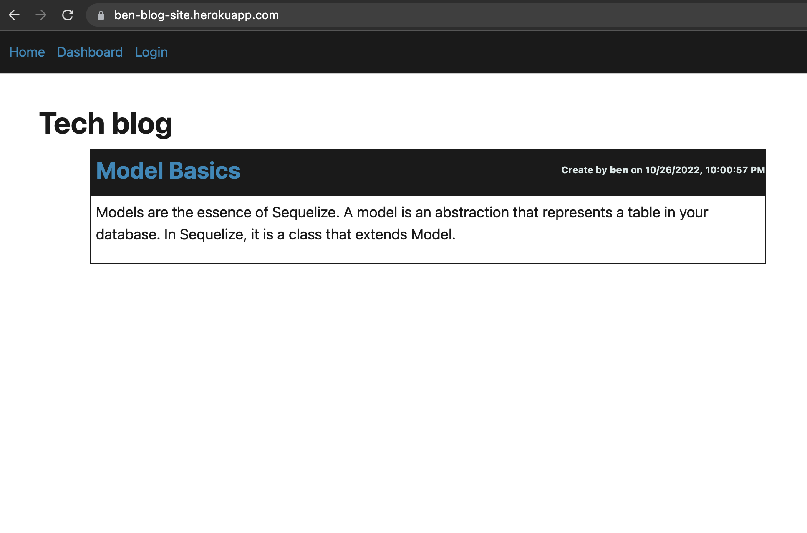
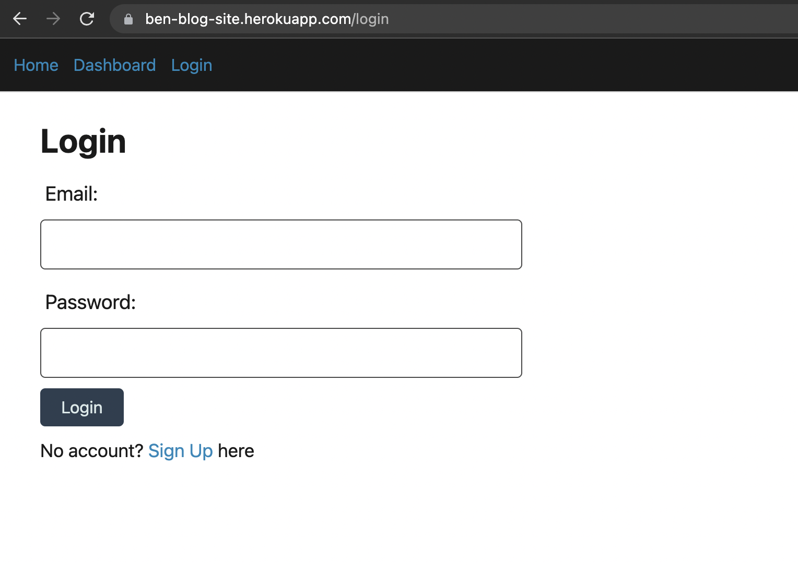
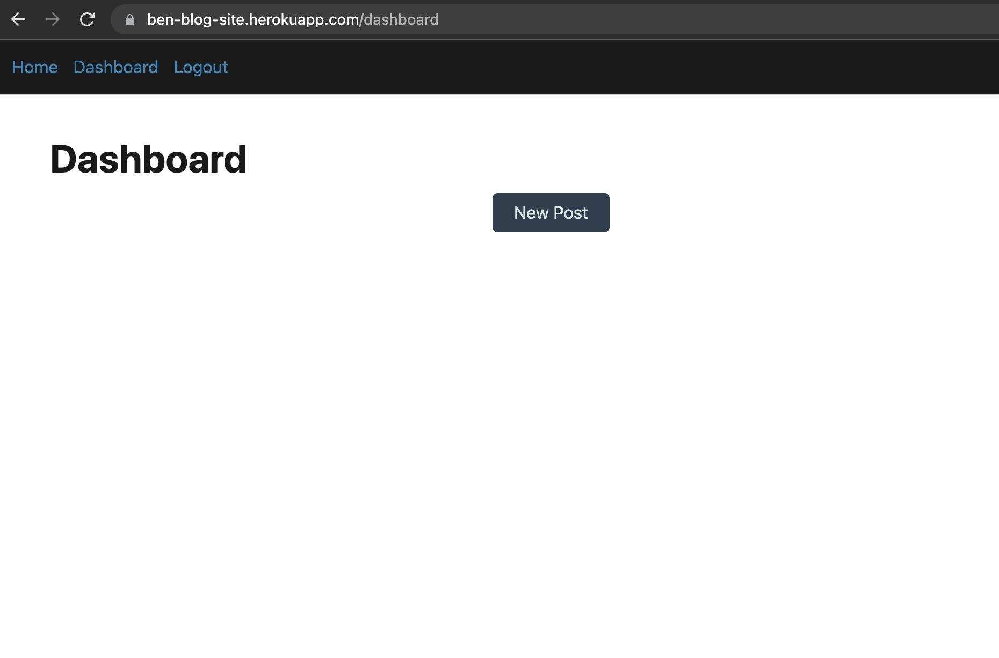
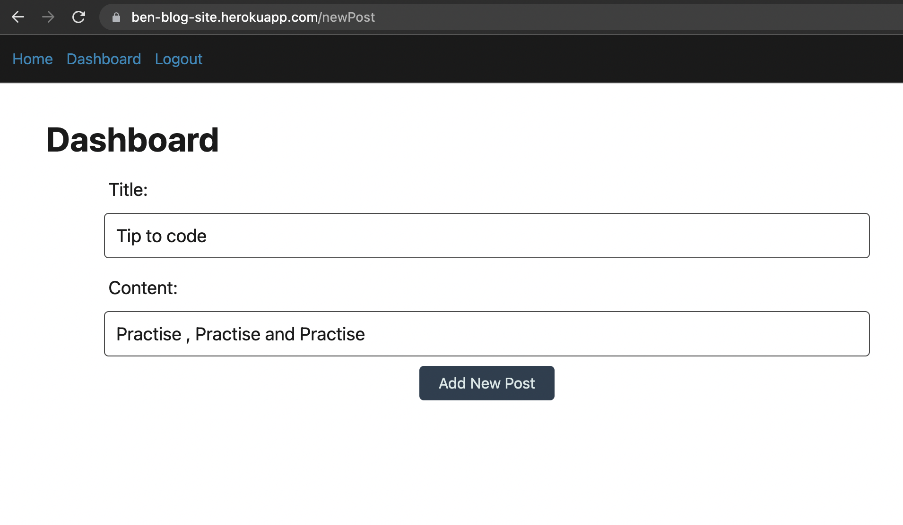
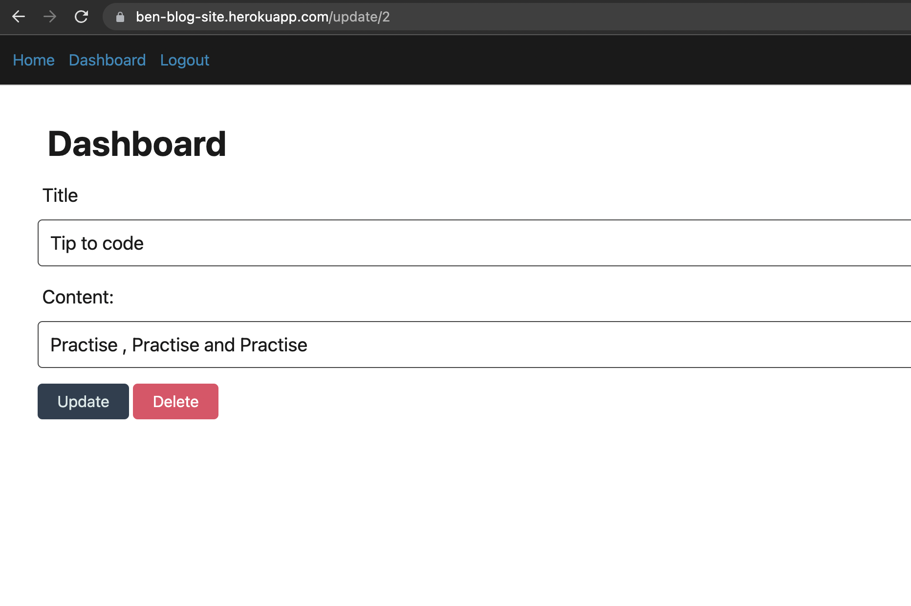
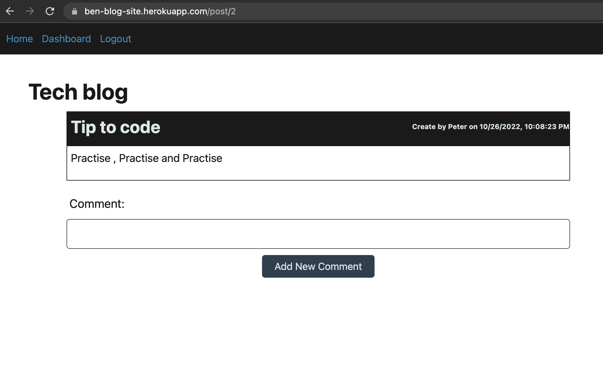

# Tech-Blog

## Description

This project is creating an online blog

## Table of Contents

- [Installation](#installation)
- [Usage](#usage)
- [Credits](#credits)
- [License](#license)
- [Tests](#tests)

## Installation

N/A

## Usage

1. Go to URL https://ben-blog-site.herokuapp.com
   

2. Click "login" to go to login page. you can login or sign up a new account
   

3. After logged in, you can create new post under dashboard
   

4. Write down the title and content of the post, and click "A New Post" to create
   

5. Under Dashboard, click on the title of your post, you can update the post
   

6. In Home Page, click on one of the title of a post, you can leave comment
   

## Credits

BenLiu104 : https://github.com/BenLiu104

## License

License - MIT

## Tests

N/A
